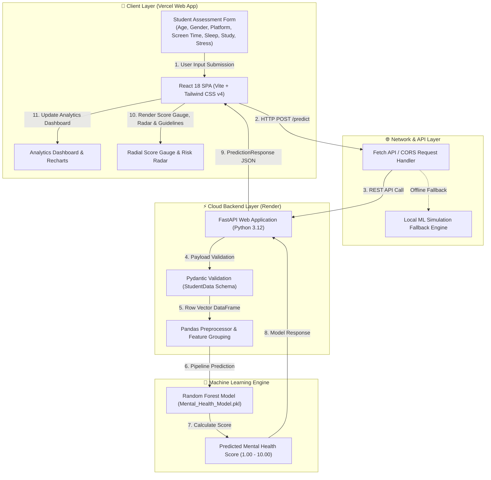

# MindMetrics AI 🧠📱
### Student Social Media & Mental Health Impact Prediction System

[](https://mind-metrics-ai-two.vercel.app/)
[](https://mindmetrics-ai-44be.onrender.com)
[](https://python.org)
[](https://fastapi.tiangolo.com)
[](https://react.dev)
[](https://vitejs.dev)
[](https://tailwindcss.com)

**MindMetrics AI** is a fullstack machine learning web application designed to evaluate, predict, and analyze student mental health indicators based on daily screen time, social media usage habits, physical activity, sleep hygiene, and academic load.

---

## 🌐 Live Production Links

- **🌐 Live Web Application (Frontend)**: [https://mind-metrics-ai-two.vercel.app/](https://mind-metrics-ai-two.vercel.app/)
- **⚡ Production API Server (Backend)**: [https://mindmetrics-ai-44be.onrender.com](https://mindmetrics-ai-44be.onrender.com)
- **📖 Interactive API Swagger Documentation**: [https://mindmetrics-ai-44be.onrender.com/docs](https://mindmetrics-ai-44be.onrender.com/docs)

---

## 📐 System Architecture & Data Flow Diagram



---

## 🔄 System I/O Architecture Diagram

```
+-----------------------------------------------------------------------------------+
|                            SYSTEM I/O ARCHITECTURE DIAGRAM                        |
+-----------------------------------------------------------------------------------+

  INPUT PARAMETERS                    PROCESSING & AI ENGINE                   OUTPUT REPORT
  [ Student Profile ]                [ FastAPI + Scikit-Learn ]               [ Visual Insights ]
  +-----------------------+          +--------------------------+          +-----------------------+
  | Age (10-100)          |          |  React 18 (Vercel App)   |          |  Predicted Score      |
  | Gender (Male/Female)  | -------> |   └─> HTTP POST /predict  | -------> |   (1.00 to 10.00 scale) |
  | Academic Level        |          +--------------------------+          +-----------------------+
  | Country               |                       |                        |  Risk Categorization  |
  | Social Platform       |                       v                        |   (Low / Moderate /   |
  | Purpose of Use        |          +--------------------------+          |    High / Critical)   |
  | Daily Screen Hours    |          |  FastAPI (Render)        | -------> +-----------------------+
  | Daily Unlock Count    |          |   ├─> Pydantic Validate  |          |  Contributing Factor  |
  | Sleep Hours / Night   |          |   └─> Pandas DataFrame   |          |  Radar Breakdown      |
  | Daily Study Hours     |          +--------------------------+          +-----------------------+
  | Physical Exercise     |                       |                        |  Personalized Action  |
  | Self-rated Stress     |                       v                        |  Plan & Guidelines    |
  +-----------------------+          +--------------------------+          +-----------------------+
                                     |  Random Forest Model     |          |  Export Data Logs     |
                                     |  (Mental_Health_Model)   | -------> |  (CSV & JSON Downloads)|
                                     +--------------------------+          +-----------------------+
```

---

## 🌟 Key Features

- **📊 Comprehensive Analytics Dashboard**:
  - Key Performance Indicators (KPIs) tracking total assessments, average mental health scores, high stress rates, screen time averages, and top impact platforms.
  - Interactive Recharts bar, line, radar, and donut/pie visualizations.
  - Usage vs Sleep & Study Impact correlation charts.

- **🤖 Interactive AI Assessment Form**:
  - Persona Presets (*Heavy Social Media User*, *Balanced Achiever*, *Exhausted Graduate*, *High School Teen*).
  - Touch-friendly range sliders with real-time numeric readouts.
  - Form validation matching backend Pydantic schemas.

- **🎯 Real-Time Prediction & Insights Report**:
  - Animated SVG radial score gauge (1.0 to 10.0 scale).
  - Multidimensional risk radar breakdown (Screen load, unlock frequency, sleep deficit, exercise protection, study intensity).
  - Tailored, evidence-based wellness action plans.

- **📜 Prediction History & Export**:
  - Filterable, searchable data table for historical student assessments.
  - One-click dataset export to **CSV** and **JSON** formats.
  - Persistent history using LocalStorage.

- **💚 Wellness Resources & Crisis Directory**:
  - Digital hygiene guidelines and Pomodoro/sleep optimization routines.
  - Confidential 24/7 helpline directory (Tele-MANAS, 988 Lifeline, Befrienders Worldwide).

- **🔄 Automatic Backend Fallback**:
  - Real-time connection monitoring with production FastAPI (`https://mindmetrics-ai-44be.onrender.com`).
  - Graceful fallback to a local ML simulation engine if the backend is offline.

---

## 🛠️ Tech Stack & Architecture

### Backend (`/backend`)
- **Language**: Python 3.12
- **Deployment**: Render Web Service
- **Framework**: FastAPI with Pydantic data validation & CORSMiddleware
- **Server**: Uvicorn
- **ML / Data Processing**: Scikit-Learn (1.6.1), Pandas, Joblib

### Frontend (`/frontend`)
- **Framework**: React 18 + Vite
- **Deployment**: Vercel
- **Styling**: Tailwind CSS v4, Vanilla CSS Glassmorphism design system
- **Icons**: Lucide React
- **Data Visualization**: Recharts
- **State & Router**: React Context API (`AppContext`), Custom Hooks (`useLocalStorage`)

---

## 📁 Repository Folder Structure

```
MindMetrics-AI/
├── backend/
│   ├── main.py                                           # FastAPI REST backend & model endpoints
│   ├── Mental_Health_Model.pkl                           # Trained Random Forest model pickle
│   ├── Student Social Media And Mental Health Impact.csv # Dataset source
│   ├── requirements.txt                                  # Python dependencies
│   ├── runtime.txt                                       # Render Python version config
│   └── README.md                                         # Backend guide
├── frontend/
│   ├── src/
│   │   ├── components/
│   │   │   ├── common/                                   # Badge, Button, Card, Input, Modal, RangeSlider, Select
│   │   │   ├── dashboard/                                # OverviewKPI, PlatformChart, RecentActivity, RiskDistribution, UsageChart
│   │   │   ├── form/                                     # DemographicFields, LifestyleFields, PredictionForm, QuickPresets, UsageFields
│   │   │   ├── history/                                  # ExportActions, FilterControls, PredictionTable
│   │   │   ├── layout/                                   # Footer, Header, Layout, Navbar, Sidebar
│   │   │   ├── resources/                                # CrisisSupport, WellBeingTips
│   │   │   └── results/                                  # PredictionResultCard, Recommendations, ScoreGauge, StressBreakdown
│   │   ├── context/                                      # AppContext.jsx
│   │   ├── hooks/                                        # useLocalStorage.js
│   │   ├── pages/                                        # DashboardPage, HistoryPage, PredictorPage, ResourcesPage, SettingsPage
│   │   ├── services/                                     # api.js, sampleData.js
│   │   ├── styles/                                       # index.css
│   │   ├── App.jsx
│   │   └── main.jsx
│   ├── .env
│   ├── .env.production
│   ├── package.json
│   ├── vite.config.js
│   └── index.html
├── .gitignore
├── ML_Project-mental-health.ipynb                         # Jupyter notebook model training
├── Mental_Health_Model.pkl                               # Root trained model
├── Student Social Media And Mental Health Impact.csv     # Root dataset
├── main.py                                               # Root FastAPI entry script
├── runtime.txt                                           # Root Python runtime config
└── README.md                                             # Root project documentation
```

---

## 🚀 Quick Start & Local Setup Guide

### 1. Setup & Run FastAPI Backend
```bash
cd backend
pip install -r requirements.txt
python -m uvicorn main:app --reload --port 8000
```

### 2. Setup & Run React Frontend
```bash
cd frontend
npm install
npm run dev
```
- **Web UI URL**: `http://localhost:5173`

---

## 📡 API Specification

### `POST https://mindmetrics-ai-44be.onrender.com/predict`
Calculates predicted mental health score based on student parameters.

#### Request Body Schema:
```json
{
  "Age": 21,
  "Gender": "Female",
  "Country": "USA",
  "Academic_Level": "Undergraduate",
  "Most_Used_Platform": "Instagram",
  "Purpose_Of_Use": "Entertainment",
  "Avg_Daily_Usage_Hours": 6.5,
  "Daily_Unlocks": 110,
  "Study_Hours": 4.0,
  "Physical_Activity_Hours": 1.0,
  "Sleep_Hours_Per_Night": 5.5,
  "Stress_Level": "High"
}
```

#### Response Body Schema:
```json
{
  "predicted_mental_health_score": 7.85
}
```

---

## 👤 Author & Maintainer

Developed by **Harsh Sachan**
- **GitHub**: [@hsachan295-source](https://github.com/hsachan295-source)
- **Repository**: [MindMetrics-AI-](https://github.com/hsachan295-source/MindMetrics-AI-.git)
